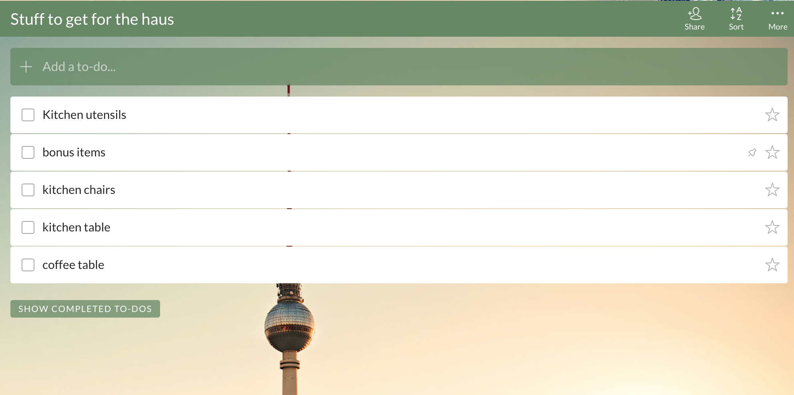

# What is React?

React is a fantastic and wildly popular tool for building websites and apps, and it creates a world where JavaScript and HTML live in happy harmony in the same files and render your ever-changing data efficiently to the browser.

## Declarative

With React, you can create reusable components that will always render the same data in the same way, which wasn't always the case pre-React. Let’s say you’re a huge Olympics fan and have a website for tracking scores. Users who visit your site won’t need to wait for the entire tree to deconstruct and reconstruct when they click a button on your site or when the newest data on the half-pipe is available. React components will update to accommodate the changing data efficiently.

## Reactive

React uses a tree reconciliation method to react to changes in input (data) efficiently by first rendering a virtual tree of data. Then, whenever any data changes, instead of rebuilding the whole tree, it just does something called “tree reconciliation.” This means it performantly renders changes, instead of rendering the entire tree (which would be inefficient).

Almost all frameworks nowadays (e.g. Angular, Vue, etc.) are approaching similar mechanisms. The virtual tree is in contrast to something like vanilla JS or jQuery where you are setting/updating `.innerHTML` DOM nodes directly.

## Easy to add to the rest of your stack

Switching your site(s) to new technologies optimally involves incrementally transferring your site over, page by page, to the new technology. This is difficult to do with some new tech, like Angular and Ember, because they are like your friend who wants to take over every social event they get invited to. They are not happy unless you involve them in the entire site, from the root on up. This means that if you want to use Angular, you have to rewrite existing code. 

React is not picky; it is happy to be used in only parts of your site, so you can incrementally refactor your code in React. It's more like an easy-going friend who is happy to help with just part of the party you're throwing. It plays nicely with others!

## Has a virtual representation of views in memory (virtual DOM)

React lets you write Javascript files that include HTML inline; this is not only visually more streamlined than keeping your HTML and JSX in different files, but also allows JSX to take the driver’s seat. 
> “[In React,] we rely on the power of JS to generate HTML that depends on some data, 
> rather than enhancing HTML to make it work with that data.” - [Samer Buna](https://medium.freecodecamp.org/yes-react-is-taking-over-front-end-development-the-question-is-why-40837af8ab76)

## Component-Based

React components and subcomponents tend to come from breaking your website down into the smallest bits possible, using the [single responsibility principle](https://en.wikipedia.org/wiki/Single_responsibility_principle). 

For example, in a To-Do list, the hierarchy of components would include: 
* Whole list
    * Title
    * add a to-do line
    * to-do line
        * subtasks within to-dos
    * show completed to-dos button

The [Reactjs.org website recommends](https://reactjs.org/docs/thinking-in-react.html) that you work with your designer(s) when creating a hierarchy of React components and subcomponents, because the designers probably already have names for each small piece of the design, and you can make sure your components have the same names. 

React components work just like other functions in any programming language because we call components with some input (called “property” and “state” in React) and spit out an output (some sort of User Interface in React). Also, components are reusable and can contain other components. All these things are the same as other functions in other programming languages. What is unique about React components is that they can have a private state to hold data that may change over time.

## Using React with Gatsby

GatsbyJS is a great way to build websites with React and actually solves some unique problems by making the following things more straightforward:
* *Pulling content in:* In Gatsby, GraphQL and plugins help you use data from nearly any source (including both traditional CMSs and headless CMSs. Some people I’ve talked to recently even built their Gatsby sites with Google sheets as the data source.
* *Creating pages and routes:* Gatsby also gives you an intuitive interface for creating pages and routes. So intuitive, in fact, that when I talked to a coworker, I said, “I remember creating pages and links to those pages from other pages, but I don’t remember creating any routes in Gatsby.” They responded, “Yeah, Gatsby took care of that for you.”
* *Solving performance problems:* Any performance problems with your site can be handled by Gatsby’s way of loading static files.
* *Creating tags and categories for your blog:* This is straightforward in Gatsby. It’s not always this straightforward in other frameworks that use React.

Gatsby combines the awesomeness of React with all the friendly helpfulness you’d hope for in a modern PWA framework. Happy coding, and let us know how it goes by joining us on [Twitter](https://twitter.com/gatsbyjs) and [Github](https://github.com/gatsbyjs/gatsby)!
